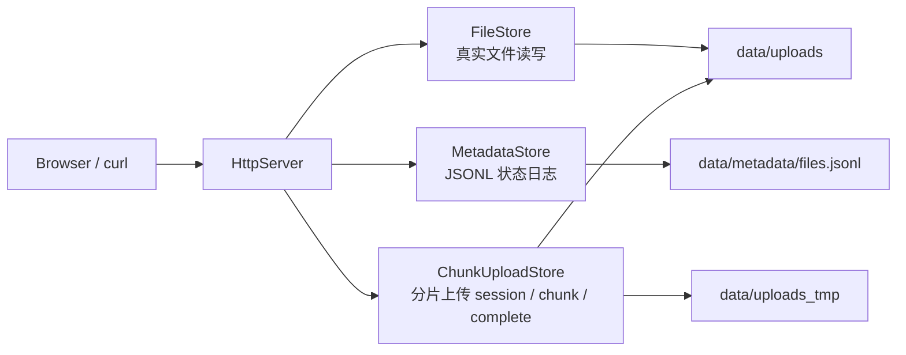

# PhotoBridge

PhotoBridge 是一个面向家庭照片流转场景的私有文件中转服务。最初的问题很具体：拍完照片后，希望另一台设备可以不用反复依赖隔空投送，也能通过浏览器访问、上传、下载和管理文件。

当前项目同时也是一个 C++ 后端学习项目：从能跑通的 HTTP 文件服务开始，逐步演进出对象存储里常见的元数据日志、状态 replay、tombstone、巡检修复和 compaction。

## 当前能力

- C++20 + CMake + `cpp-httplib` 实现 HTTP 服务。
- `GET /health` 健康检查。
- `GET /` 返回 `web/index.html` 上传页面。
- `POST /api/upload` 支持 raw body 上传。
- `POST /api/upload-form` 支持浏览器表单上传。
- `GET /api/files` 基于 metadata replay 返回当前可见文件。
- `GET /api/files/{filename}/download` 下载指定文件。
- `POST /api/files/delete` 删除真实文件，并写入 `delete/deleted` tombstone。
- `GET /api/metadata` 查看原始 JSONL metadata log。
- `GET /api/metadata/count` 返回 metadata 记录数。
- `GET /api/metadata/audit` 对比 metadata 与 `data/uploads`，发现 `MissingFile` / `OrphanFile`。
- `POST /api/metadata/repair` 自动修复低风险 `MissingFile`，再返回剩余问题数量。
- `POST /api/metadata/repair-missing` 单文件修复缺失状态。
- `POST /api/metadata/mark-missing` 手动标记文件缺失。
- `POST /api/metadata/compact` 将 append-only metadata log 压缩为每个文件最新状态。
- `POST /api/uploads/init` 初始化分片上传 session。
- `POST /api/uploads/chunk` 上传指定 chunk。
- `GET /api/uploads/status` 查询当前 session 已上传 / 缺失 chunk。
- `POST /api/uploads/complete` 合并 chunk，写入 metadata，并清理临时 session。
- 文件接口使用 `PHOTO_BRIDGE_TOKEN` 做最小 token 鉴权。
- 已在 Windows 本地和 Alibaba Cloud Linux 3 上完成基础运行验证。

## 技术栈

| 类别 | 技术 |
| :-- | :-- |
| 语言 | C++20 |
| 构建 | CMake |
| HTTP | `cpp-httplib` |
| 元数据 | append-only JSONL |
| 前端 | 原生 HTML/CSS/JavaScript |
| 本地开发 | Windows + MinGW / PowerShell |
| 服务器验证 | Alibaba Cloud Linux 3 |

## 项目架构

PhotoBridge 目前采用非常轻量的分层结构：



核心职责：

- `HttpServer`：处理 HTTP 路由、鉴权、状态码和响应格式。
- `FileStore`：管理真实文件的保存、下载路径和删除。
- `MetadataStore`：管理 append-only metadata log、状态 replay、audit、repair 和 compaction。
- `ChunkUploadStore`：管理分片上传 session、chunk 临时目录、status 查询和 complete 合并。

## 项目结构

```text
PhotoBridge/
├── CMakeLists.txt
├── include/photobridge/
│   ├── FileMetadata.h
│   ├── FileStore.h
│   ├── HttpServer.h
│   ├── ChunkUploadStore.h
│   └── MetadataStore.h
├── src/
│   ├── ChunkUploadStore.cpp
│   ├── FileStore.cpp
│   ├── HttpServer.cpp
│   ├── MetadataStore.cpp
│   └── main.cpp
├── web/
├── config/
├── data/
│   ├── uploads/
│   ├── uploads_tmp/
│   ├── metadata/
│   └── logs/
└── third_party/
```

`data/uploads/`、`data/uploads_tmp/`、`data/metadata/`、`data/logs/` 是运行时数据目录，不提交到 Git。

## 构建运行

### Windows

```powershell
cd D:\PhotoBridge
cmake -S . -B build
cmake --build build
$env:PHOTO_BRIDGE_TOKEN="your-token"
.\build\PhotoBridge.exe
```

访问：

```text
http://127.0.0.1:8080/health
http://127.0.0.1:8080/
http://127.0.0.1:8080/api/files?token=your-token
```

Windows 下建议使用 `curl.exe`，避免 PowerShell 的 `curl` 别名干扰。

### Linux

以 Alibaba Cloud Linux 3 / RHEL 系为例：

```bash
dnf install -y gcc gcc-c++ make cmake git tar gzip
cd /root/PhotoBridge
cmake -S . -B build
cmake --build build
PHOTO_BRIDGE_TOKEN=your-token ./build/PhotoBridge
```

服务默认监听：

```text
0.0.0.0:8080
```

如果 `build/` 是从 Windows 复制过来的，需要删除后在 Linux 上重新生成：

```bash
rm -rf build
cmake -S . -B build
cmake --build build
```

## API 示例

### 健康检查

```bash
curl "http://127.0.0.1:8080/health"
```

### 文件列表

```bash
curl "http://127.0.0.1:8080/api/files?token=your-token"
```

### Raw body 上传

```powershell
curl.exe -X POST "http://127.0.0.1:8080/api/upload?token=your-token&filename=hello.txt" --data-binary "hello from upload"
```

### 表单上传

```powershell
curl.exe -X POST "http://127.0.0.1:8080/api/upload-form?token=your-token" -F "file=@D:\PhotoBridge\web\index.html"
```

### 下载

```bash
curl -OJ "http://127.0.0.1:8080/api/files/test.jpg/download?token=your-token"
```

### 删除文件并写入 tombstone

```powershell
curl.exe -X POST "http://127.0.0.1:8080/api/files/delete?token=your-token&filename=test.jpg"
```

### 查看 metadata log

```bash
curl "http://127.0.0.1:8080/api/metadata?token=your-token"
```

### 巡检 metadata 与真实文件

```bash
curl "http://127.0.0.1:8080/api/metadata/audit?token=your-token"
```

### 自动修复 MissingFile

```powershell
curl.exe -X POST "http://127.0.0.1:8080/api/metadata/repair?token=your-token"
```

### 压缩 metadata log

```powershell
curl.exe -X POST "http://127.0.0.1:8080/api/metadata/compact?token=your-token"
```

### 分片上传：初始化 session

```powershell
$init = curl.exe -X POST "http://127.0.0.1:8080/api/uploads/init?token=your-token&filename=big.bin&size=16&chunk_size=6" | ConvertFrom-Json
$session = $init.session_id
```

### 分片上传：上传 chunk

```powershell
curl.exe -X POST "http://127.0.0.1:8080/api/uploads/chunk?token=your-token&session_id=$session&index=0" --data-binary "hello "
curl.exe -X POST "http://127.0.0.1:8080/api/uploads/chunk?token=your-token&session_id=$session&index=2" --data-binary "test"
```

### 分片上传：查询断点续传状态

```powershell
curl.exe "http://127.0.0.1:8080/api/uploads/status?token=your-token&session_id=$session"
```

示例响应：

```json
{
  "result": "success",
  "session_id": "1779181378980567400",
  "filename": "big.bin",
  "total_size": 16,
  "chunk_size": 6,
  "chunk_count": 3,
  "status": "pending",
  "uploaded_count": 2,
  "missing_count": 1,
  "uploaded_indexes": [0, 2],
  "missing_indexes": [1]
}
```

### 分片上传：补传缺失 chunk 并完成合并

```powershell
curl.exe -X POST "http://127.0.0.1:8080/api/uploads/chunk?token=your-token&session_id=$session&index=1" --data-binary "chunk "
curl.exe -X POST "http://127.0.0.1:8080/api/uploads/complete?token=your-token&session_id=$session"
```

`complete` 成功后会把最终文件写入 `data/uploads/`，追加 metadata `chunk-upload-complete/completed` 记录，并清理 `data/uploads_tmp/upload_<session_id>/` 临时 session。

## Metadata 设计

PhotoBridge 当前使用 append-only JSONL 记录文件状态变化：

```json
{"schema_version":1,"op":"upload","filename":"a.jpg","content_type":"image/jpeg","size":12345,"uploaded_at":"2026-05-14T08:00:00Z","status":"completed"}
{"schema_version":1,"op":"delete","filename":"a.jpg","content_type":"","size":0,"uploaded_at":"2026-05-14T08:10:00Z","status":"deleted"}
```

核心思路：

- `appendFile()` 只追加新记录，不原地修改旧记录。
- `listLatestRecords()` 按 `filename` replay 出每个文件最新状态。
- `listFiles()` 只展示最终状态为 `completed` 的文件。
- `delete` 不只是删除真实文件，还追加 `deleted` tombstone。
- `repair` 会自动把 `MissingFile` 写成 `repair-missing/missing`。
- `compact()` 会把多条历史记录压缩为每个文件一条最新状态。
- 分片上传 `complete` 成功后会追加 `chunk-upload-complete/completed` 记录，使 `/api/files` 能通过 metadata replay 看见最终文件。

`compact()` 使用中间文件保护：

```text
files.jsonl.tmp  新压缩结果
files.jsonl.bak  旧 metadata 备份
```

流程是先写 `.tmp`，再把旧文件改名为 `.bak`，最后用 `.tmp` 替换正式文件；如果替换失败，会尽量恢复 `.bak`。

## 跨平台说明

- Windows 下 `cpp-httplib` 需要链接 `ws2_32`。
- Linux 下 `std::thread` / `cpp-httplib` 需要链接 `Threads::Threads`。
- 当前 `CMakeLists.txt` 已处理 `_WIN32_WINNT=0x0A00`、`WINVER=0x0A00`、`ws2_32` 和 `Threads::Threads`。

## 开发工作流

当前项目以小版本闭环推进：

```text
实现一个最小能力 -> 本地编译 -> curl/浏览器验证 -> README/日志记录 -> commit/push
```

推荐本地检查：

```powershell
cmake --build D:\PhotoBridge\build
.\scripts\smoke_test.ps1
git -C D:\PhotoBridge status
```

服务器侧推荐重新拉取后构建：

```bash
cd /root/PhotoBridge
git pull
cmake --build build
PHOTO_BRIDGE_TOKEN=your-token ./build/PhotoBridge
```

## 代码规范

- 文件管理逻辑放在 `FileStore`，不要在 HTTP 层直接拼接真实文件路径。
- 元数据状态变更统一通过 `MetadataStore` 追加 JSONL 记录，不直接覆盖旧记录。
- 对来自 HTTP 的 `filename` 参数做安全校验，拒绝空文件名、`..`、`/` 和 `\`。
- HTTP 层负责把内部结果映射成明确状态码，例如 `400`、`401`、`404`、`409`、`500`。
- 当前 JSONL parser 只面向项目自己生成的固定格式，不作为通用 JSON parser 使用。

## 测试与验收

当前还没有自动化单元测试，主要通过本地构建、curl 和 PowerShell smoke test 做功能验收。

本地 smoke test：

```powershell
cd D:\PhotoBridge
$env:PHOTO_BRIDGE_TOKEN="your-token"
.\scripts\smoke_test.ps1
```

当前 `scripts/smoke_test.ps1` 覆盖：

- `GET /health` 健康检查。
- 分片上传 init。
- 故意只上传 chunk `0` 和 `2`，通过 `/api/uploads/status` 验证缺失 chunk `1`。
- 补传 chunk `1`，再次验证 `missing_count == 0`。
- complete 合并、metadata 索引可见、通过 delete API 清理最终文件。
- 普通 raw body 上传、列表、删除。
- `MissingFile` audit / repair。
- metadata compact。

建议每个小版本至少验证：

- `GET /health` 返回 `OK`。
- 上传后 `/api/files` 能看到文件。
- 下载接口能取回原文件。
- 删除接口会删除真实文件，并追加 `delete/deleted` tombstone。
- `audit -> repair -> audit` 能修复 `MissingFile`。
- `compact` 后 `files.jsonl` 只保留每个文件最新状态。
- 分片上传 status 能正确返回 `uploaded_indexes` 和 `missing_indexes`。
- complete 成功后 `/api/files` 能看到分片合并出的最终文件。

后续计划继续补充 Linux 侧 `scripts/smoke_test.sh` 和更细粒度的 C++ 单元测试。

## 贡献方式

这是一个学习型项目，当前优先级是保持实现简单、可解释、可验证。提交改动时建议遵循：

- 一个提交对应一个明确小版本或一个独立文档更新。
- README 与接口行为保持同步。
- 不提交 `data/uploads/`、`data/metadata/`、`data/logs/` 等运行时数据。
- 不提交 `data/uploads_tmp/` 中的分片临时 session。
- 不提交真实 token、服务器私钥或个人文件。

## 当前限制

- 这是学习与实验项目，不建议长期直接暴露公网 `8080`。
- token 鉴权仍是最小实现，不是完整用户系统。
- JSONL 解析器只面向本项目固定格式，不是通用 JSON parser。
- `compact()` 当前会跳过解析失败的记录，后续需要补 `skipped_records` 统计或失败保护。
- `remaining_issues` 目前返回数量，后续可升级为完整 JSON 数组。
- 分片上传 / 断点续传目前是最小实现，还没有 chunk checksum、重复 chunk 幂等判断和冲突检测。
- 还没有 HTTPS、Nginx 反代和 systemd 后台服务。

## 下一步

- V2.1：为 chunk 增加 size / checksum 校验，避免错误 chunk 被合并。
- V2.1：处理重复上传同一 chunk 的幂等与冲突检测。
- 为 `compact()` 增加解析失败记录统计与保护策略。
- 将 `/api/metadata/repair` 的 `remaining_issues` 从数量升级为问题数组。
- 抽出公共文件名校验与 JSON 输出工具。

## License

当前仓库尚未添加明确 License。正式开源前需要补充 `LICENSE` 文件，并在这里说明授权方式。
