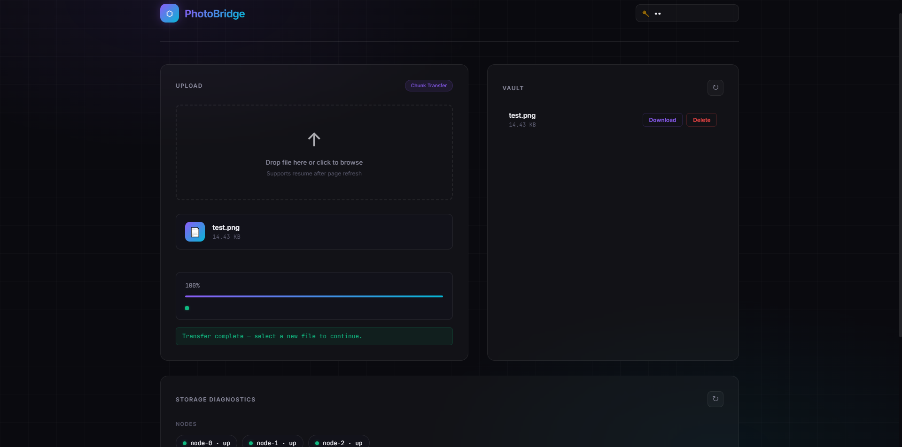
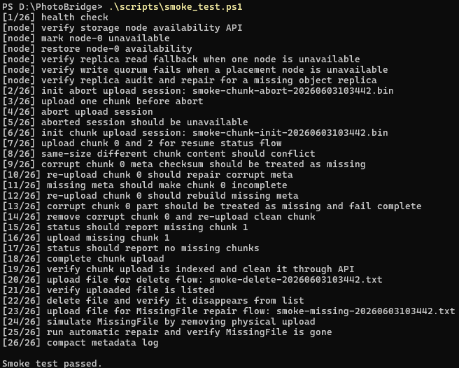

# PhotoBridge

[English](README.md) | [简体中文](README.zh-CN.md)

PhotoBridge 是一个轻量级 C++ HTTP 存储服务，用于私有文件中转、断点续传和存储后端实验。

项目最初是一个浏览器文件上传/下载服务，目前已经扩展出 metadata replay、分片上传、CRC32C 校验、分片数据放置、多副本、节点可用性、placement 查询和副本修复等能力。

## 功能特性

- HTTP 文件上传、下载、列表和删除。
- append-only JSONL metadata log，支持 replay、audit、repair 和 compact。
- 断点续传：session 状态、chunk 上传、abort、cleanup、CRC32C 校验。
- 统一 Object-style StorageBackend 抽象。
- 本地、分片、多副本存储后端。
- StorageNode 抽象，支持节点可用性控制。
- placement 查询、副本审计和副本修复 API。
- PowerShell smoke test 和上传 benchmark 脚本。

## 技术栈

- C++20
- CMake
- cpp-httplib
- JSONL metadata
- 本地文件系统存储
- PowerShell smoke / benchmark 脚本

## 架构概览

```text
Client / Browser / curl
        |
        v
HttpServer
        |
        +-- FileStore
        |
        +-- MetadataStore
        |
        +-- ChunkUploadStore
                |
                v
        ReplicaStorageBackend
                |
                v
        StorageNode -> LocalStorageBackend
```

运行时数据位于 `data/`，不会提交到 Git。

```text
data/
├── metadata/       # append-only metadata log
├── uploads/        # 已完成文件
├── uploads_tmp/    # 分片上传临时 session
└── shards/         # 本地 shard / replica 数据
```

## 界面截图



## 构建

### Windows

```powershell
cd D:\PhotoBridge
cmake -S . -B build
cmake --build build
```

运行：

```powershell
$env:PHOTO_BRIDGE_TOKEN="change-me"
.\build\PhotoBridge.exe
```

### Linux

```bash
git clone https://github.com/Bryson-wz/PhotoBridge.git
cd PhotoBridge
cmake -S . -B build
cmake --build build
```

运行：

```bash
export PHOTO_BRIDGE_TOKEN="change-me"
./build/PhotoBridge
```

服务默认监听 `0.0.0.0:8080`。

长期运行时建议用 `systemd` 或 `supervisor` 等进程管理工具托管。正式 service 模板后续补充。

## 快速开始

健康检查：

```bash
curl "http://127.0.0.1:8080/health"
```

上传文件：

```bash
curl -X POST \
  "http://127.0.0.1:8080/api/upload?token=change-me&filename=hello.txt" \
  --data-binary "hello photobridge"
```

查看文件列表：

```bash
curl "http://127.0.0.1:8080/api/files?token=change-me"
```

下载文件：

```bash
curl -OJ "http://127.0.0.1:8080/api/files/hello.txt/download?token=change-me"
```

删除文件：

```bash
curl -X POST "http://127.0.0.1:8080/api/files/delete?token=change-me&filename=hello.txt"
```

## 断点续传

初始化上传 session：

```bash
curl -X POST \
  "http://127.0.0.1:8080/api/uploads/init?token=change-me&filename=big.bin&size=11&chunk_size=6"
```

上传 chunk：

```bash
curl -X POST \
  "http://127.0.0.1:8080/api/uploads/chunk?token=change-me&session_id=<session_id>&index=0" \
  --data-binary "hello "

curl -X POST \
  "http://127.0.0.1:8080/api/uploads/chunk?token=change-me&session_id=<session_id>&index=1" \
  --data-binary "world"
```

查询上传状态：

```bash
curl "http://127.0.0.1:8080/api/uploads/status?token=change-me&session_id=<session_id>"
```

完成上传：

```bash
curl -X POST "http://127.0.0.1:8080/api/uploads/complete?token=change-me&session_id=<session_id>"
```

取消上传：

```bash
curl -X POST "http://127.0.0.1:8080/api/uploads/abort?token=change-me&session_id=<session_id>"
```

## API 概览

| Method | Path | 说明 |
| --- | --- | --- |
| `GET` | `/health` | 健康检查 |
| `GET` | `/` | 浏览器上传页面 |
| `POST` | `/api/upload` | raw body 上传 |
| `POST` | `/api/upload-form` | 表单上传 |
| `GET` | `/api/files` | 查看当前可见文件 |
| `GET` | `/api/files/{filename}/download` | 下载文件 |
| `POST` | `/api/files/delete` | 删除文件并追加 tombstone |
| `GET` | `/api/metadata` | 查看 metadata log |
| `GET` | `/api/metadata/audit` | metadata 与 uploads 巡检 |
| `POST` | `/api/metadata/repair` | 修复安全的 metadata 问题 |
| `POST` | `/api/metadata/compact` | 压缩 metadata log |
| `POST` | `/api/uploads/init` | 创建分片上传 session |
| `POST` | `/api/uploads/chunk` | 上传单个 chunk |
| `GET` | `/api/uploads/status` | 查询已上传和缺失 chunk |
| `POST` | `/api/uploads/complete` | 合并 chunk 为最终对象 |
| `POST` | `/api/uploads/abort` | 删除上传 session |
| `POST` | `/api/uploads/cleanup-expired` | 清理过期 session |
| `GET` | `/api/storage/nodes` | 查看存储节点 |
| `POST` | `/api/storage/node/availability` | 切换节点可用性 |
| `GET` | `/api/storage/placement` | 查询 object placement |
| `GET` | `/api/storage/replicas/audit` | 审计 object 副本 |
| `POST` | `/api/storage/replicas/repair` | 修复缺失副本 |

大多数写接口需要 `token=<PHOTO_BRIDGE_TOKEN>`。

## 测试

先启动服务，再运行冒烟测试：

```powershell
cd D:\PhotoBridge
$env:PHOTO_BRIDGE_TOKEN="change-me"
.\scripts\smoke_test.ps1
```

在 Windows 上请用 PowerShell 7（`pwsh`）运行冒烟测试。Windows PowerShell 5.1
的 `ConvertFrom-Json` 存在解析 JSON 数组的 bug，会导致节点相关检查失败：

```powershell
pwsh -NoProfile -File .\scripts\smoke_test.ps1 -Token change-me
```

冒烟测试覆盖完整链路：健康检查、存储节点可用性、副本读回退 / 写多数派、
副本审计与修复、断点续传分片上传（含冲突、损坏、续传场景）、文件删除，
以及元数据审计 / 修复 / 压缩。

通过结果：



精简后的运行日志如下：

```text
[1/26] health check
[node] verify storage node availability API
[node] verify replica read fallback when one node is unavailable
[node] verify write quorum fails when a placement node is unavailable
[node] verify replica audit and repair for a missing object replica
...
[18/26] complete chunk upload
[19/26] verify chunk upload is indexed and clean it through API
[22/26] delete file and verify it disappears from list
[25/26] run automatic repair and verify MissingFile is gone
[26/26] compact metadata log

Smoke test passed.
```

运行上传 benchmark：

```powershell
.\scripts\benchmark_upload.ps1 `
  -BaseUrl "http://127.0.0.1:8080" `
  -Token "change-me" `
  -FileSizeMB 16,64 `
  -ChunkSizeMB 1,2,4
```

如果要观察单次请求的性能，可用 `PHOTO_BRIDGE_PERF=1` 启动服务。
开启后会向 stdout 输出 `[perf] uploads.init/chunk/status/complete elapsed_ms=<n>`，
默认关闭。

```powershell
$env:PHOTO_BRIDGE_TOKEN="change-me"
$env:PHOTO_BRIDGE_PERF="1"
.\build\PhotoBridge.exe
```

## 配置

当前主要通过环境变量和本地运行时目录配置。

| 名称 | 说明 |
| --- | --- |
| `PHOTO_BRIDGE_TOKEN` | 受保护 API 使用的共享 token |
| `PHOTO_BRIDGE_PERF` | 设为 `1` 时向 stdout 输出单次请求的 `elapsed_ms`（默认关闭） |

不要提交运行时数据、真实 token 或私有配置文件。

## 仓库结构

```text
include/photobridge/   公共头文件
src/                   C++ 实现
web/                   浏览器上传页面
scripts/               smoke / benchmark 脚本
third_party/           header-only 依赖
data/                  运行时数据，Git 忽略
```

## Roadmap

- 使用 `perf`、`strace` 和 flamegraph 做性能分析。
- 完善存储节点故障模拟。
- 增强 metadata recovery 和 compaction 保护。
- 补充 Linux service 部署模板。
- 在存储层稳定后，再做协议层实验。

## License

暂未选择开源许可证。
