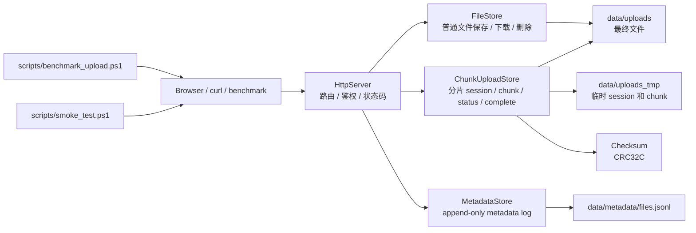

# PhotoBridge 存储系统设计

## 定位

PhotoBridge 当前不是完整分布式存储系统，而是一个单机对象存储雏形。它把真实文件服务拆成几个存储系统常见子问题：

- 对象写入：普通上传和分片上传最终都会生成 `data/uploads/<filename>`。
- 分片暂存：大文件先写入 `data/uploads_tmp/upload_<session_id>/chunks/`。
- 完整性校验：每个 chunk 使用 CRC32C 校验，避免损坏分片进入 complete 阶段。
- 元数据日志：文件状态通过 append-only JSONL 记录，再 replay 出当前可见状态。
- 故障恢复：支持 status、补传、abort、cleanup、audit、repair 和 compact。
- 性能观测：通过 route timer 和 benchmark 观察上传、状态查询、合并阶段耗时。

## 架构图



## 数据路径

普通上传路径：

```text
POST /api/upload
-> HttpServer 校验 token 和 filename
-> FileStore 写入 data/uploads/<filename>
-> MetadataStore 追加 upload/completed
-> /api/files 通过 metadata replay 看见文件
```

分片上传路径：

```text
POST /api/uploads/init
-> 创建 data/uploads_tmp/upload_<session_id>/session.json
-> 创建 chunks/ 目录

POST /api/uploads/chunk
-> 校验 session_id、index、chunk size
-> 写 chunk_<index>.part
-> 计算 CRC32C
-> 写 chunk_<index>.meta

GET /api/uploads/status
-> 读取 session.json
-> 遍历 chunk part/meta
-> 校验 size + CRC32C
-> 返回 uploaded_indexes / missing_indexes

POST /api/uploads/complete
-> 再次校验所有 chunk part/meta
-> 按 index 顺序合并到 data/uploads/<filename>
-> MetadataStore 追加 chunk-upload-complete/completed
-> 清理 data/uploads_tmp/upload_<session_id>
```

这个路径对应对象存储里的几个核心概念：multipart upload、commit、object metadata、checksum、replay 和 cleanup。

## 元数据路径

PhotoBridge 的 metadata 使用 append-only JSONL，而不是原地更新：

```text
upload/completed
delete/deleted
mark-missing/missing
repair-missing/missing
chunk-upload-complete/completed
```

读取当前状态时，`MetadataStore` 会 replay 所有记录：

```text
同一个 filename 多条记录
-> 后面的记录覆盖前面的记录
-> listFiles 只返回 status == completed
```

这样做的好处是：

- 写入简单：状态变化只追加，不直接覆盖旧记录。
- 容易审计：可以看到文件状态的历史变化。
- 适合演进：后续可以把 JSONL 替换成 WAL、SQLite 或独立 metadata server。
- 能引出分布式存储问题：replay、compact、tombstone、repair 都是存储系统里的基础概念。

## 故障恢复路径

| 场景 | 当前处理 | 对应的存储系统概念 |
|---|---|---|
| chunk 未上传 | status 返回 missing index | 断点续传 |
| chunk meta 丢失 | status 视为 missing，重传会重建 meta | 元数据修复 |
| chunk 内容损坏 | CRC32C 不匹配，status 视为 missing，complete 失败 | 数据完整性校验 |
| complete 中途失败 | 删除半成品最终文件，保留 session | 原子 commit 的前置设计 |
| 用户取消上传 | abort 删除 session 目录 | 生命周期管理 |
| session 过期 | cleanup-expired 删除旧 session | 临时对象清理 |
| metadata 指向缺失文件 | audit 发现 MissingFile | 一致性巡检 |
| 真实文件没有 metadata | audit 发现 OrphanFile | 元数据与数据反查 |
| metadata log 膨胀 | compact 保留每个文件最新状态 | 日志压缩 |

## 性能观测如何连接系统设计

性能观测不是独立功能，而是用来回答系统设计里的具体问题：

| 观测指标 | 对应系统路径 | 可以回答的问题 |
|---|---|---|
| `init_ms` | session metadata 创建 | session 初始化是否有明显固定成本 |
| `upload_ms` | chunk 写入 + CRC32C + meta 写入 | 主要写入路径吞吐是多少 |
| `avg_chunk_ms` | 单 chunk 请求 | chunk size 是否过小或过大 |
| `p95_chunk_ms` | chunk 请求尾延迟 | 是否存在抖动或慢请求 |
| `status_ms` | session replay + chunk part/meta 校验 | 断点续传状态查询成本 |
| `complete_ms` | 顺序读取 chunk + 写最终文件 + metadata append | commit 阶段是否成为瓶颈 |
| `total_throughput_mib_s` | 端到端数据路径 | 用户视角整体吞吐 |
| `complete_throughput_mib_s` | 合并路径 | 本地存储顺序读写能力 |

因此，`docs/performance.md` 中的 benchmark 结果可以反向解释系统设计：

- 本地 64 MiB / 4 MiB chunk 端到端吞吐约 5.11 MiB/s，说明单机完整链路已经可测。
- 远端公网 64 MiB / 4 MiB chunk 端到端吞吐约 2.20 MiB/s，说明公网链路和远端处理成为主要成本。
- chunk 越大，请求数越少，吞吐提升，说明 HTTP 往返和 per-chunk 元数据操作有固定开销。
- complete 随文件大小近似线性增长，说明合并阶段符合顺序 IO 特征。

## 设计边界

当前阶段故意保持单机实现，暂不引入过重复杂度：

- 暂不做多副本。
- 暂不做一致性协议。
- 暂不做真正 RPC 框架。
- 暂不做后台异步 commit。
- 暂不做高性能异步日志。

这些不是“不知道怎么做”，而是为了先把单机数据路径、元数据路径、恢复路径和观测路径讲清楚。

## 面向 V3.0 的演进

下一步最有价值的是抽出 `StorageBackend`：

```cpp
class StorageBackend {
public:
    virtual WriteResult writeChunk(...) = 0;
    virtual ReadResult readChunk(...) = 0;
    virtual DeleteResult deleteChunk(...) = 0;
    virtual CommitResult commitObject(...) = 0;
};
```

第一版实现仍然是本地磁盘：

```text
LocalStorageBackend -> data/uploads + data/uploads_tmp
```

后续可以演进为：

```text
ReplicaStorageBackend -> 多副本写入
ShardedStorageBackend -> 按 object_id / chunk_id 分片
RemoteStorageBackend -> RPC storage node
```

这样 PhotoBridge 就从“文件中转服务”自然变成“迷你对象存储系统实验台”。

## 相关文档

- [性能观测与 Benchmark](./performance.md)
- [README](../README.md)
- [MVP](./MVP.md)
